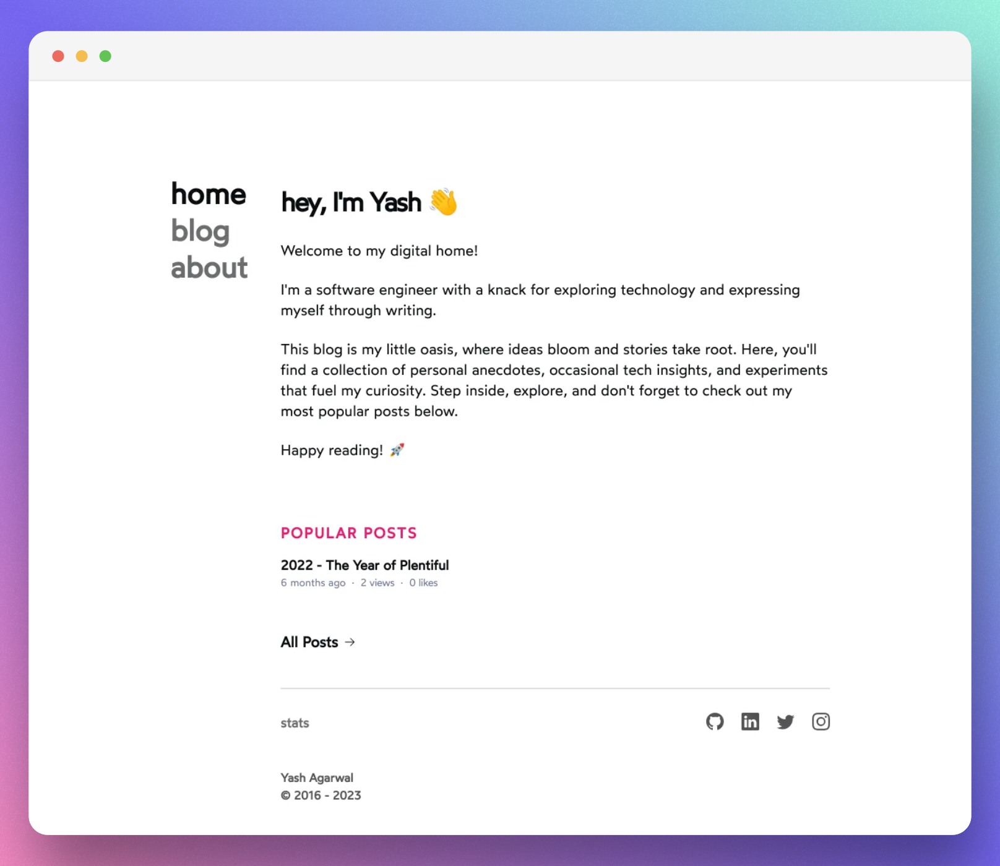

# yashagarwal.in



This blog is my digital home. Here, you'll find a collection of personal anecdotes, occasional tech insights, and experiments that fuel my curiosity.
I use this website as a medium to explore new web technologies. Currently I am learning React and NextJs so I decided to migrate my Hugo blog to NextJs. You can check the code of my previous Hugo blog [here](https://github.com/yashhere/tufte.yashagarwal.in).

## Inspiration

While I modified the source code of this repository significantly, I forked [Emma](https://www.emmacampbell.dev/) Campbell's [codegarden](https://github.com/emma-campbell/codegarden) to begin with. My inexperience with TailwindCSS forced me to look for a good base to build upon. Emma's website was perfect for my usecase, so I decided to take her code. Since then, I have modified the code heavily but the influence of her design is still evident on my blog. I will continue working on my TailwindCSS skills to alter the design of this blog to my liking and requirements.

Below is a brief list of websites I took some inspiration from -

1. <https://www.emmacampbell.dev/>
2. <https://delba.dev/>
3. <https://leerob.io/>
4. <https://anishde.dev/>

## What's it built with?

Wanna know what I used to build it without diving too far into the source code? Yeah?! Well, here you go.

- Framework (NextJs13): [Next.js](https://nextjs.org)
- Content: [contentlayer](https://www.contentlayer.dev)
- Design: [tailwindcss](https://tailwindcss.com)
- Database: [Planetscale](https://planetscale.com)
- ORM: [Prisma](https://www.prisma.io/) and [Kysely](https://github.com/kysely-org/kysely)
- Deployment: [Vercel](https://vercel.com/)

Took me two months of work and some serious scoldings from my wife for not giving her enough time 😂. Hope you will like it.

## What's still to come?

- [ ] **Move from `mdx` to `notion` for CMS.**
- [ ] Implement full-text search on the `/blog` page
- [ ] Implement a Twitter like streams connected to Notion
- [ ] Move to Redis for storing sessions and statistics
- [ ] Live reloading of metrics on view change
- [ ] Add proper error handling
- [ ] Custom 404 and 500 page
- [ ] Tooltips
- [ ] Table of contents
- [ ] Native NextJs-13 opengraph-image generation

## Running Locally

There a few minor steps to getting up and running.

### 1. Clone the Repo

```sh
git clone https://github.com/yashhere/yashagarwal.in
```

### 2. Install Dependencies

```sh
bun
```

<!-- ### 3. Setting up the Database -->

### 4. Start the Server

```sh
bun dev
```

## Repository Structure

The repository is structure as follows

```bash
./
├── .contentlayer/
├── .husky/
├── .next/
├── .vscode/
├── app/
├── components/
├── config/
├── content/
├── lib/
├── prisma/
├── public/
├── styles/
├── types/
├── .commitlintrc.json
├── .editorconfig
├── .env.local
├── .eslintrc.json
├── .gitignore
├── .nvmrc
├── .prettierignore
├── .prettierrc.js
├── README.md
├── contentlayer.config.js
├── env.mjs
├── giscus.json
├── middleware.tsx
├── next-env.d.ts
├── next.config.js
├── package.json
├── postcss.config.js
├── screenshot-12-07-2023.png
├── tailwind.config.js
├── tsconfig.json
└── bun.lock
```

- `content` - articles/posts and related definitions
- `lib` - resuable library code (like hooks)
- `primsa` - database ORM definitions
- `public` - hosted assets
- `styles` - css and styling files
- `components` - reusable components

## License

Please reference my [license](./LICENSE.md) for relevant information.
