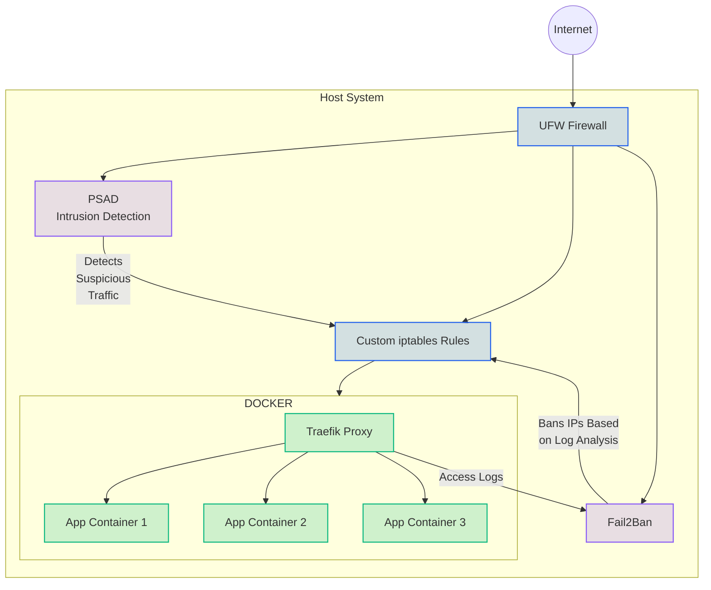
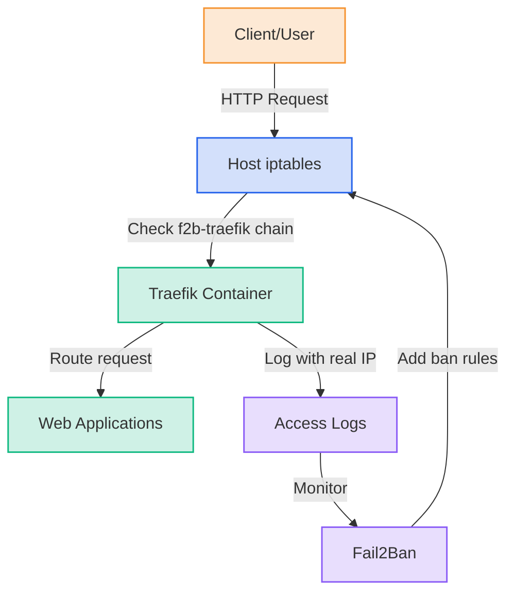
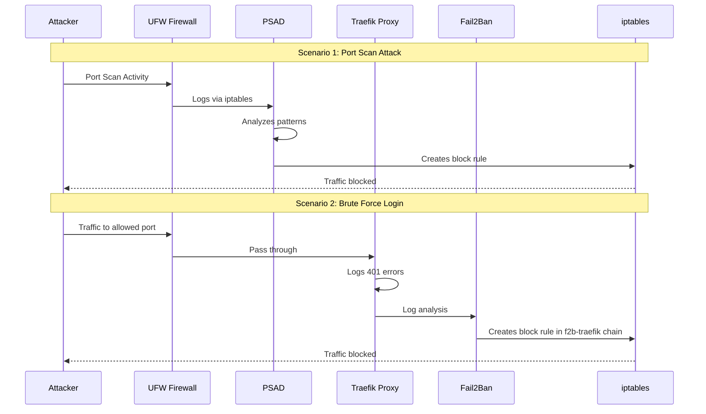

When exposing a reverse proxy like [Traefik](https://traefik.io/) to the public internet, security should be a top priority. I recently deployed Traefik on a public-facing Linux server to route traffic to Docker containers — and I wanted a robust, layered security model to defend against port scans, brute-force attacks, and misbehaving clients.

In this post, I’ll walk through how I secured my Traefik setup using UFW, Fail2Ban, and PSAD — combining firewall rules, intrusion detection, and log-based banning into an effective security stack.

# Why a Layered Security Model?

Each component of this stack plays a specific role:

- **UFW:** Acts as our first line of defense by controlling which ports are exposed and accessible
- **iptables:** Powers UFW and handles low-level packet filtering; we'll also configure it directly.
- **PSAD:** Monitors network traffic to detect and block potential intrusion attempts like port scans
- **Fail2Ban:** Analyzes application logs (Traefik in our case) to identify and block malicious behavior



Think of these tools as concentric security rings:

- UFW defines what doors are open to the internet
- PSAD monitors suspicious activity at those doors
- Fail2Ban watches how visitors behave once they're allowed through a door

# Layer 1: UFW (Uncomplicated Firewall)

UFW provides a simplified interface to `iptables`. My approach is **"deny by default"** - block everything unless explicitly allowed.

## Installation

```bash
sudo apt install ufw
```

## Configuration

```bash
# Deny all traffic by default
sudo ufw default deny outgoing comment 'deny all outgoing traffic'
sudo ufw default deny incoming comment 'deny all incoming traffic'

# Allow SSH (don't lock yourself out!)
sudo ufw limit in ssh comment 'allow SSH connections in'

# Allow web traffic for Traefik
sudo ufw allow 80/tcp comment 'allow HTTP'
sudo ufw allow 443/tcp comment 'allow HTTPS'

# Allow essential outbound traffic
sudo ufw allow out 53 comment 'allow DNS calls out'
sudo ufw allow out 123 comment 'allow NTP out'
sudo ufw allow out http comment 'allow HTTP traffic out'
sudo ufw allow out https comment 'allow HTTPS traffic out'
```

## Enable and Verify

```bash
sudo ufw enable
sudo ufw status verbose
```

# Layer 2: PSAD (Port Scan Attack Detector)

PSAD monitors network traffic through iptables logs to detect and optionally block scanning activity and other suspicious traffic.

## Installation

```bash
sudo apt install psad
```

## Configuration

1. Make a backup of the configuration:

```bash
sudo cp --archive /etc/psad/psad.conf /etc/psad/psad.conf-BACKUP
```

2. Edit `/etc/psad/psad.conf` and update these settings:

```text
EMAIL_ADDRESSES         your@email.address;
HOSTNAME                your-server-hostname;
EXPECT_TCP_OPTIONS      Y;         # Enable TCP options logging
ENABLE_PSADWATCHD       Y;
ENABLE_AUTO_IDS         Y;         # Enable auto-blocking
ENABLE_AUTO_IDS_EMAILS  Y;         # Enable email notifications
```

3. Configure UFW to log traffic for PSAD by modifying both `/etc/ufw/before.rules` (for IPv4) and `/etc/ufw/before6.rules` (for IPv6). First make a backup of both files:

```bash
sudo cp --archive /etc/ufw/before.rules /etc/ufw/before.rules-BACKUP
sudo cp --archive /etc/ufw/before6.rules /etc/ufw/before6.rules-BACKUP
```

Add these lines to both files before the `COMMIT` line:

In `/etc/ufw/before.rules`:

```text
# log all traffic so psad can analyze

-A ufw-before-input -j LOG --log-tcp-options --log-prefix "[IPTABLES] "
-A ufw-before-forward -j LOG --log-tcp-options --log-prefix "[IPTABLES] "
```

In `/etc/ufw/before6.rules`:

```text
# log all traffic so psad can analyze

-A ufw6-before-input -j LOG --log-tcp-options --log-prefix "[IPTABLES] "
-A ufw6-before-forward -j LOG --log-tcp-options --log-prefix "[IPTABLES] "
```

**Note:** Using `ufw-before-input` and `ufw-before-forward` chains instead of directly modifying `INPUT` and `FORWARD` is crucial for proper integration with UFW.

4. Reload and Verify

```bash
sudo ufw reload
sudo psad -R
sudo psad --sig-update
sudo psad -H
```

5. Analyze Firewall Logs and Check PSAD Status

```bash
sudo psad --fw-analyze
sudo psad --Status
```

If `psad --fw-analyze` shows issues, you can check your mail by executing the `mail` command. For this to work, you need to provide `<user>@localhost` as the email address in `EMAIL_ADDRESSES` field of the `psad.conf` file.

# Layer 3: Fail2Ban (Application Intrusion Prevention)

Fail2Ban scans log files for malicious activity and blocks offending IPs using iptables. We will configure it to monitor Traefik logs for suspicious behavior.

## Installation

```bash
sudo apt install fail2ban
```

## Basic Configuration

Create a local configuration file to avoid editing the default one:

```bash
sudo vim /etc/fail2ban/jail.local
```

Add the following content:

```ini
[DEFAULT]

# Ignore local IPs
ignoreip = 127.0.0.1/8 192.168.0.0/16 10.0.0.0/8 172.16.0.0/12

# Email notifications
destemail = your@email.address
sender = your@email.address
mta = mail

# Get detailed email alerts
action = %(action_mwl)s
```

## Traefik Configuration

First, make sure Traefik is configured to output access logs in a format Fail2Ban can process:

```yaml
# In traefik.yml
log:
  level: debug

accessLog:
  filepath: /var/log/traefik/access.log
  format: common
```

```yaml
# In docker-compose.yml
services:
  traefik:
    image: traefik:v3
    container_name: traefik
    volumes:
      - ./traefik.yml:/etc/traefik/traefik.yml:ro
      - ./logs:/var/log/traefik
      ...
      ...
```

## Creating Traefik Filters for Fail2Ban

Create a filter for authentication failures:

```bash
sudo vim /etc/fail2ban/filter.d/traefik-auth.conf
```

Add this content:

```ini
[Definition]
failregex = ^<HOST> - .* "GET .* (401|403) .*$
            ^<HOST> - .* "POST .* (401|403) .*$
ignoreregex =
```

Create a filter for rate limiting (this will require setting up Traefik's rate limiting middleware):

```bash
sudo vim /etc/fail2ban/filter.d/traefik-ratelimit.conf
```

Add this content:

```ini
[Definition]
failregex = ^<HOST> - .* "GET .* (429) .*$
            ^<HOST> - .* "POST .* (429) .*$
            ^<HOST> - .* "PUT .* (429) .*$
            ^<HOST> - .* "DELETE .* (429) .*$
ignoreregex =
```

## Setting Up Jail Configurations

Create a jail file for Traefik:

```bash
sudo vim /etc/fail2ban/jail.d/traefik.conf
```

Add this content:

```ini
[traefik-auth]
enabled = true
port = http,https
filter = traefik-auth
logpath = /path/to/your/traefik/logs/access.log
maxretry = 3
bantime = 1h
findtime = 10m

[traefik-ratelimit]
enabled = true
port = http,https
filter = traefik-ratelimit
logpath = /path/to/your/traefik/logs/access.log
maxretry = 5
bantime = 30m
findtime = 5m
```

# Integrating Docker Networking with Security Tools

Docker's networking requires special attention to ensure our security tools work properly.

## The Challenge with Docker Networks

When you use Docker, it creates its own network namespace and manipulates iptables rules to handle routing between containers and the outside world. This presents two main challenges for Fail2Ban:

1. **Visibility Issue:** In a standard Docker setup, container logs show the internal Docker network IPs (like 172.17.0.x) rather than the actual client IPs.
2. **Ban Enforcement Issue:** When Fail2Ban tries to ban an IP, it adds rules to the host's iptables, but these rules might not affect traffic that's already being handled by Docker's networking rules.

## Creating a Custom Fail2Ban Action for Docker

```bash
sudo vim /etc/fail2ban/action.d/iptables-traefik-docker.conf
```

Add this content:

```ini
[Definition]
actionstart = iptables -N f2b-traefik
              iptables -A f2b-traefik -j RETURN
              iptables -I FORWARD -p tcp -m multiport --dports 80,443 -j f2b-traefik

actionstop = iptables -D FORWARD -p tcp -m multiport --dports 80,443 -j f2b-traefik
             iptables -F f2b-traefik
             iptables -X f2b-traefik

actionban = iptables -I f2b-traefik 1 -s <ip> -j DROP

actionunban = iptables -D f2b-traefik -s <ip> -j DROP
```

Update your jail configuration to use this action:

```ini
[traefik-auth]
# ... existing configuration
action = iptables-traefik-docker

[traefik-ratelimit]
# ... existing configuration
action = iptables-traefik-docker
```

## How the Solution Works

1.  Getting Real Client IPs in Traefik
    First, we need to ensure Traefik logs show the real client IPs:
    - Traefik automatically captures the real client IP when properly configured
    - The `accesslog.format=common` setting ensures these IPs are logged in a format Fail2Ban can parse
2.  The Custom iptables Action (`iptables-traefik-docker.conf`) modifies iptables to work with Docker's networking:

    1. **On Start (actionstart):**

       1. `iptables -N f2b-traefik`: Creates a new custom chain called "f2b-traefik"
       2. `iptables -A f2b-traefik -j RETURN`: Adds a default rule that returns traffic flow to the parent chain
       3. `iptables -I FORWARD -p tcp -m multiport --dports 80,443 -j f2b-traefik`: Inserts a rule at the beginning of the FORWARD chain to route HTTP/HTTPS traffic through our custom chain

       This setup intercepts packets in the FORWARD chain, which is crucial because Docker traffic typically passes through this chain.

    2. **On Ban (actionban):**

       - `iptables -I f2b-traefik 1 -s <ip> -j DROP`: Inserts a rule at the beginning of our custom chain to drop packets from the banned IP

    3. **On Unban (actionunban):**

       - `iptables -D f2b-traefik -s <ip> -j DROP`: Removes the ban rule for the specific IP

    4. **On Stop (actionstop):**
       1. `iptables -D FORWARD -p tcp -m multiport --dports 80,443 -j f2b-traefik`: Removes our custom chain from the FORWARD chain
       2. `iptables -F f2b-traefik`: Flushes (clears) all rules in our custom chain
       3. `iptables -X f2b-traefik`: Deletes our custom chain



This approach ensures bans are effective even with Docker's network abstractions.

# Testing the Security Setup

After configuring all components, it's important to test your setup:

## Test UFW

```bash
sudo ufw status verbose
```

## Test PSAD

```bash
sudo psad --Status
```

## Test Fail2Ban

```bash
sudo fail2ban-client status
sudo fail2ban-client status traefik-auth
sudo fail2ban-client status traefik-ratelimit
```

## Verify iptables Rules

```bash
sudo iptables -L f2b-traefik -n
```

# Maintenance and Monitoring

Regular maintenance is crucial for keeping your security stack effective:

## Check Logs Regularly

```bash
sudo tail -f /var/log/fail2ban.log
sudo tail -f /var/log/psad/psad.log
```

## Update Signatures

```bash
sudo psad --sig-update
```

## Unban IPs When Needed

```bash
sudo fail2ban-client set traefik-auth unbanip 192.168.1.100
```

## Review Banned IPs Periodically

```bash
sudo fail2ban-client status traefik-auth
```

# Visualizing the Attack Scenarios

To better understand how these components interact during an attack, let's visualize two common scenarios:

1. **Port Scan Attack**: An attacker scans for open ports on your server.
2. **Brute Force Login**: An attacker tries to guess login credentials for your applications.



# Conclusion

Hardening a reverse proxy like Traefik on a public host isn’t a set-it-and-forget-it operation. This layered approach — combining firewall rules, intrusion detection, and log-based banning — ensures you're actively defending against real-world threats.

If you're running Docker in production or even just experimenting in a homelab, these practices are well worth the effort.

Let me know if you have any questions or if you want to share your own security setups! If you found this post helpful, consider sharing it with others who might benefit from it. Happy securing!

# Additional Resources

- [How to Secure a Linux Server](https://github.com/imthenachoman/How-To-Secure-A-Linux-Server)
