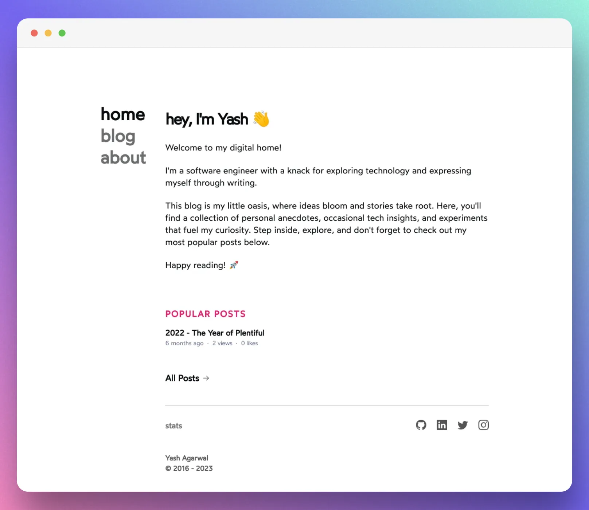

Hugo, the fastest static site generator of the world, served me well for almost 7 years. I made several iterations to my blog in these seven years. However, in these years, the web has advanced by leaps and bounds, and my aspirations have grown by an equal magnitude, if not more. I began to desire a lot more from my blog. I wanted a new design using the latest tools and real-time data fetching using APIs. Above everything else, my zeal to keep learning kept me dissatisfied with Hugo. Hugo made some improvements to incorporate [JS](https://gohugo.io/hugo-pipes/js/), but I neither had time to understand these nor was I convinced about it. Perhaps, I knew Hugo so well after working on it for so long, that the idea of transitioning away from it felt intimidating.

At last, I decided to start looking away from Hugo in 2021. I was fixated on migrating to a JavaScript-based SSG for almost two years. I finally tried my hands on [Gatsby](https://github.com/yashhere/yashagarwal.in-v2-failed) in 2022, but I failed spectacularly — perhaps because I was in my courtship period then, I couldn't devote enough time to learn the intricacies of a new framework.

After that, I shelved the idea due to lack of time. However, the complexity of writing in markdown kept preventing me from writing continuously, which meant there was almost zero activity on my blog.

# Why now?

About two months ago, while casually browsing Twitter, I came across a tweet mentioning the use of Notion as a CMS for a Next.js blog, all thanks to the newly released Notion API. As soon as I read the post, I knew I had to try it. The reason was simple - it would help me solve my most prominent [problem](/notes/2021-a-bullish-year#blogging-and-writing) of the past few years - the separation of content from the code. I was long looking for a way to solve this issue. Notion's editor is intuitive, full of features, easy to use and available on all platforms I use regularly.

# Roadblocks

It was time to start brushing my web development skills again. React is in trend currently, and Next.js is a popular framework built upon it. I had also heard about TailwindCSS and how it is used to create almost every website nowadays. So I decided to use these two to build my website.

However, it was more complicated than I thought it would be. My lack of knowledge of TypeScript and TailwindCSS meant I struggled to get basic functionality working for almost one month. Fetching and integrating Notion data using its API proved even more tedious. The state of Notion API, the performance issues, and the community support are not in ideal shape for an absolute JS beginner like me. I found [Contentlayer](https://www.contentlayer.dev/), which is a translation layer to convert the content into JSON format suitable for use in code. It has a plugin to convert Notion data to JSON. However, this plugin is in the alpha stage, and has several limitations.

As I struggled with adding Notion support, I made a _tough_ decision. I decided to drop the idea of using Notion as CMS for the time being and use the MDX for storing the content while simultaneously honing my design and JS skills and return to Notion once I am more confident about my skills. To reduce the complexity, I have decided not to use any custom React component in my MDX files. I will still write in Notion and once the article is ready, I will copy-paste it to an MDX file and commit the file to Git. A bit of manual setup is involved here, but I am okay with it. This setup would've worked with my Hugo blog, too, but over time, I had integrated so many [custom](https://github.com/yashhere/tufte.yashagarwal.in/blob/source/content/posts/2019-06-26-travelogue-Chikmagalur/index.md?plain=1#L24) shortcodes that the markdown files no longer looked like markdown. This time, I am intentionally sticking to the standard markdown syntax to simplify any future migration.

# Base Design

I found it challenging to adapt TailwindCSS, partly because I was returning to CSS after a long time and partly because I have had problems understanding technologies that tend to abstract away the complexities of underlying concepts. I still remember my struggles with understanding Python purely because I got so habitual to coding in the C language that the built-in methods provided by the Python language confused me.

As I struggled with Tailwind and coding in raw CSS was not a good option with Next.js, I decided to look for a portfolio that could act as a base for my changes. The [portfolio](https://www.emmacampbell.dev/) of Emma Campbell was the right fit for my requirements. It was built with Next.js App Router and TailwindCSS. It had all the features I required (except a few, like Table of Contents). Above all, I could understand the codebase, so it was easy to dive in and make changes to the design.

# Features

Some functionality was already present in Emma's codebase -

1. Contentlayer integration
2. Views Counter using Kysely and Planetscale
3. Code highlighting

I added/improved several other features to the codebase -

1. MathJax support
2. RSS feed and sitemap generation
3. Dark mode support
4. Giscus comments
5. Umami and Cloudflare analytics
6. Simplified code highlighting implementation
7. OpenGraph image generation

I plan to add following features to this blog in future -

1. Table of contents
2. Image component improvements
   1. Caption support
   2. Gallery and “Click to Expand” feature
3. Tooltips
4. 404/500 pages
5. Change OG image generation implementation
6. Add a dark mode toggle button
7. Full text search on blog page
8. Move to Redis to reduce latencies
9. Proper error handling in components
10. IndieWeb

and many more …

# Inspirations

This blog was only possible with many amazing people open-sourcing their blogs. I took inspiration from their design and sometimes picked up their code. Here is a brief and incomplete list of blogs that influenced me a lot - [Emma Campbell](https://www.emmacampbell.dev/), [Lee Robinson](https://leerob.io/), [Delba de Oliveira](https://delba.dev/), [Anish De](https://anishde.dev/), and [Josh W Comeau](https://www.joshwcomeau.com/)

# Coming Next

I plan to write separate articles explaining how I implemented every feature mentioned above. Stay tuned!
