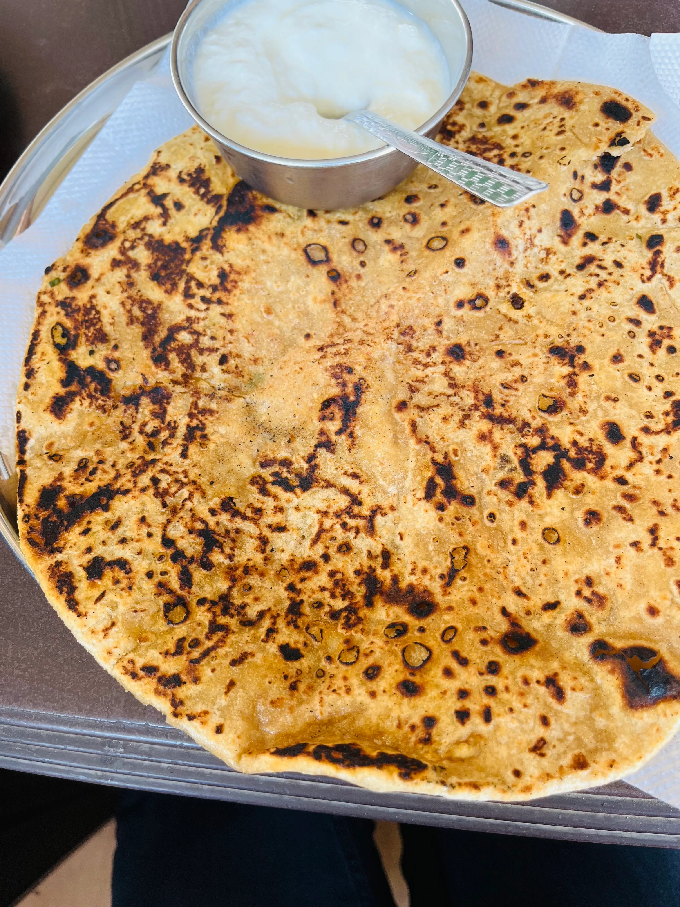
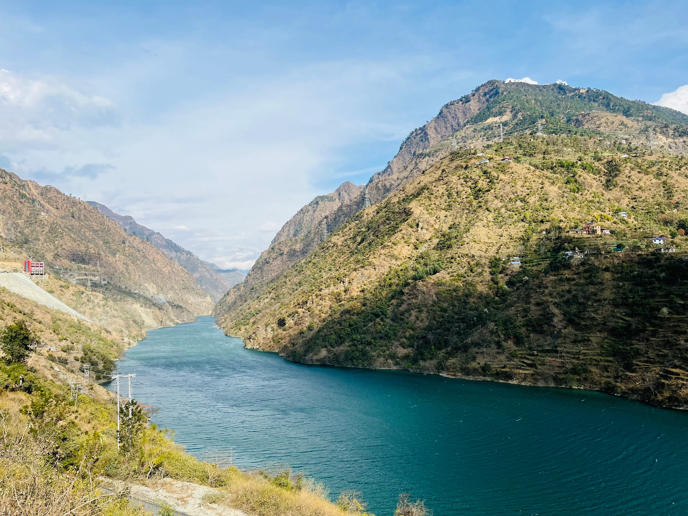
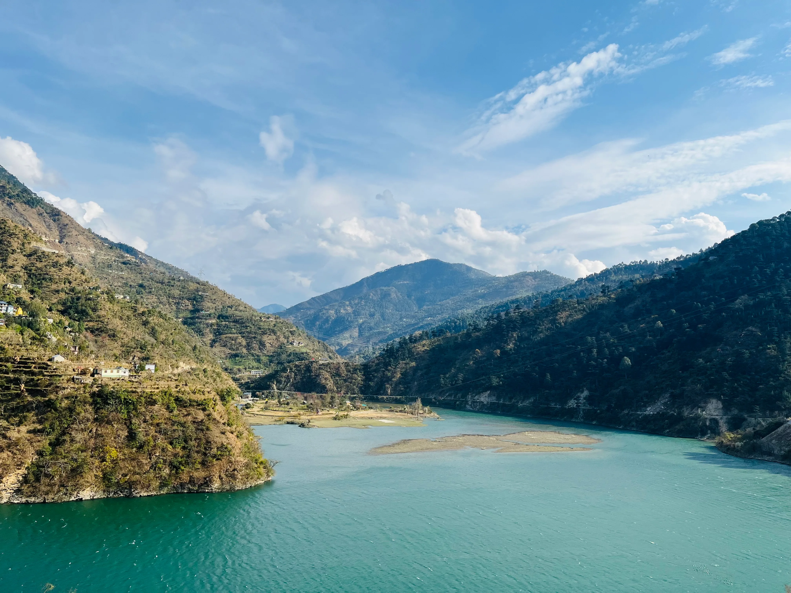
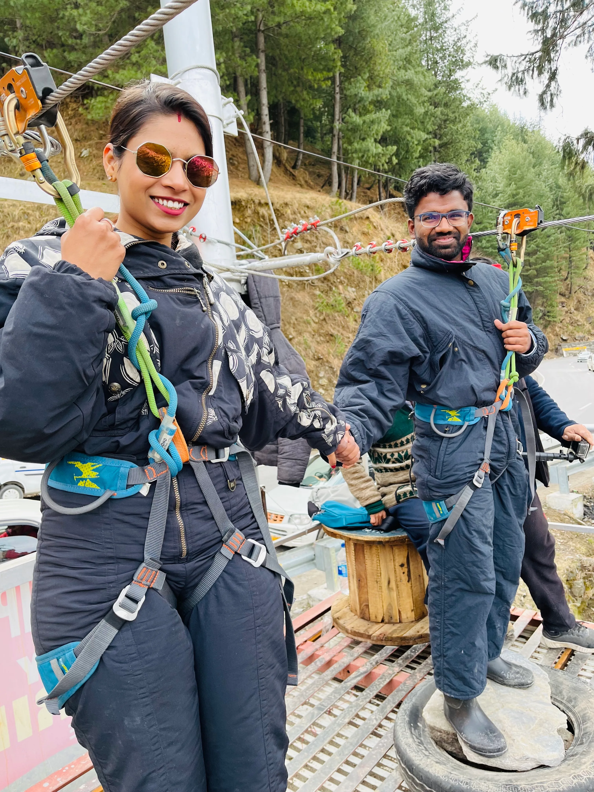
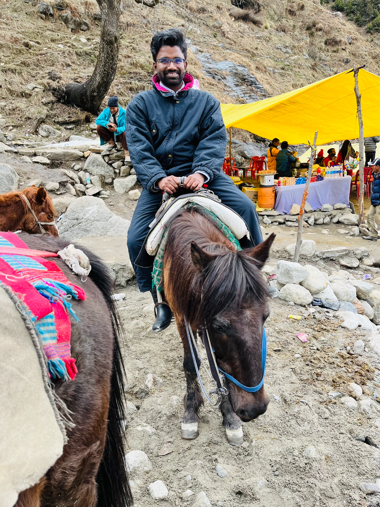
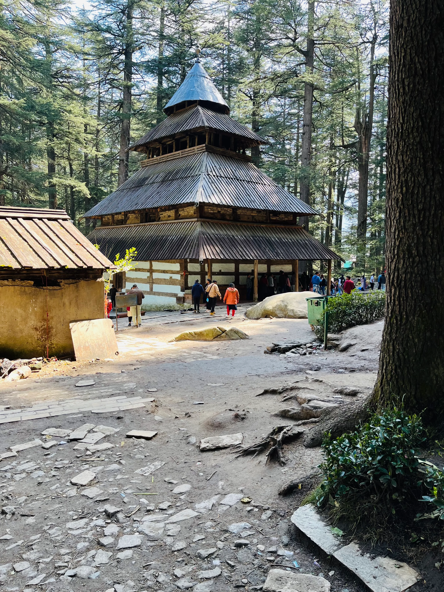

After our honeymoon got delayed for unfortunate reasons, we contemplated a short trip somewhere nearby. I had not visited the mountains until then, so I started looking for destinations in the Himalayas. Kashmir was the obvious choice, but I wanted to spend more than a few days in Kashmir which was not feasible then. Alternatives were to look for hill stations in Himachal and Uttarakhand. At last, we decided to go to Manali in Himachal Pradesh. We planned the trip for March 1, 2023, to March 4, 2023. The forecast was of rain, but still, we decided to go ahead.

# Planning Stage

While planning the trip, I started looking for different options. One option was to book the tour through a tour operator in Jaipur, so the operator would take care of our commute, hotel, sightseeing and other activities. I also searched online websites like MakeMyTrip for packages. I found both these options to be expensive. Apart from that, one of my friends went to Manali last December. He also suggested not to opt for these two options. Ultimately, we decided to reach Chandigarh by train and then book a package.

To reach Chandigarh, I booked Ajmer - Chandigarh Garib Rath Express for February 28. I had never travelled in a 3AC coach on Indian railways, so this was my first experience. I really liked it. The journey was smooth. They provide everything - blankets, bedsheets, pillows, pillow covers. However, I was slightly cautious about using these items at that time due to the prevailing COVID situation. Alas, the cold forced me to ignore my suspicions.

# Jaipur to Chandigarh

We reached Chandigarh early next morning at around 7 AM. One person showed us his travel agent's leaflet when we got off the train. I made a mistake here. Instead of inquiring there, I just went along with him. I blame the rain partly for this. It was showering mildly then, and I found it convenient to go with him. The guy took us to his travel agent's office, where we were explained the package. Although the tour package contained everything we read online, it had a few missing locations, which none of us noticed. Apart from this, we should've asked about hotel details. Later we found out that the hotel given to us was far away from the main centre of Manali.

When it came to negotiations, I fumbled. I should've negotiated a bit more, but I didn't, and we settled on ₹18,000 for the package. Later I was told that the same tour could've been done in even ₹14-15k.

Another thing we didn't keep in mind was to negotiate the pricing of the hotel where we were going for refreshments before leaving for Manali. Ultimately the hotel owner took ₹400 for spending just one hour in a shady room.

# Road Trip to Manali

The road distance between Chandigarh and Manali is around 300 km. I usually hesitate about road travel due to motion sickness, but we had no choice. We started at around 9.30 AM from Chandigarh. After about an hour, we stopped at a roadside dhaba for breakfast.

The driver then drove without stopping until we stopped for lunch at around 2.00 PM at Mayur Restaurant in Sundar Nagar. The restaurant was good, but we were not in good shape because of motion sickness.

After having lunch, we drove for another hour before we reached the scenic Pandoh Dam. The view from here is beautiful, and the rush of air hitting your face makes you forget everything and enjoy the wonders of nature.

We spent nearly 45 minutes here before our driver reminded us that we may get late for Manali. So, with a heavy heart, we left the place and proceeded on our journey.

# The River Rafting in Kullu

Afterwards, we drove for another two hours before reaching Kullu. By this time, drizzles had started, and the roads of Kullu were wholly soaked with heavenly pours. In Kullu, we had options to do Paragliding and Rafting. As the weather was not conducive, we decided to go for rafting. Despite the rains, the river was not at its full strength, and nobody was along with us for rafting. So we and our guide boarded the boat and started our adventure. We booked a one-hour rafting tour for about a 10 km stretch of river. It cost us ₹6500 for the river rafting. This includes the safety gear and guide fee. We rented out waterproof clothing for another ₹200 per person. The guide offered us to shoot a video on his GoPro for ₹1500. Though slightly expensive, we agreed because we couldn't risk taking our mobile while on the boat. Despite the exorbitant charges, it was one of a kind experience.

The guide fitted us with the safety gear - life jackets and helmets and then instructed us on handling the ride. The journey in the river started river, but soon we were hit by our first set of rapids. There was repeated turbulence beneath us, but the guide guided the boat carefully. Each time there was a strong wave, we were hit with cold water splashes from the Beas.

We spent nearly an hour in the river, and by the time we reached the endpoint, we were drenched and shivering because of the icy water of the river. We immediately ran to a bonfire nearby and started giving ourselves the heat. It was so cold that I could put my foot in the fire without hurting myself. The vendor there offered us coffee. That tiny cup of coffee cost me ₹30, but it was invaluable then. The guide dropped us at our boarding point, where our driver was waiting. After payment and getting the videos on our phones, we started our journey again. After this, we were to stop only at our hotel.

# The Hotel

Our hotel, [The Snow Mount](https://goo.gl/maps/HAkDmQTxH9VicUD97), was so remote that a tourist couldn't reach it without a car. We were very disappointed with our haphazardness while driving to this place. By the time we got there, it was almost 8.30 PM at night. We were starving, so we decided to order simple food. We were exhausted due to car travel, so after finishing dinner, we decided to call it a day.

# Solang Valley

The following day, I woke up early and as soon as I went outside to check the balcony, all my frustration disappeared. The view was breathtakingly beautiful. We quickly got ready and came downstairs for breakfast. After having breakfast, our driver suggested that instead of going to the city sightseeing, we first go to Solang Valley because the weather forecast was gloomy for the next day. We agreed and proceeded to visit the Solang Valley. On the way, we stopped to book activities at Solang Valley. We booked zipline, mountain bike, Yak ride and tube ride. Looking back, I think we could've done with zipline and Yak rides only as well. All these activities cost us ₹5000. The snow dresses cost another ₹500.

## Ziplining

We had never done ziplining, so it was a unique experience. Although the height of our zipline was not much, as a first experience, I am satisfied with it.

## First view of the valley

After this, we went straight to the Solang Valley. This was my first view of the snow in real life, and I was totally awestruck by the vastness of it. We went in the low season, so a lot of snow had melted, but still, I could see the ocean of snow in front of me. What would be the scene after the heavy snowfalls we hear about in the news?

## Mountain Bike

When we finally reached the valley, the driver dropped us at the parking, from where the tour operator's mountain bike picked us up. The terrain was rocky, and we needed to go uphill. The ride was full of ups and downs, and we enjoyed it thoroughly. Was it a must-have? I don't think so. It is a good experience, but if you don't opt for it, you won't miss it. Later, I also got a chance to drive it.

## Yak Ride

After this, we were taken to Yak Ride. I saw a Yak for the first time and was instantly mesmerised by this animal. We were allowed to spend about 15 minutes on the animal.

## Tube Ride

After the Yak ride, we went for a tube ride. I don't know what is the point of this activity. People were being slid from the top of a cliff in a rubber tube on a snow trail. It took not more than 10 seconds from top to bottom, and that's it. You are done. This is the height of looting people. I fell for the same and immediately regretted it.

  <video
    src="https://user-images.githubusercontent.com/13733968/253254179-3b909866-ea4a-486c-b8bf-d22e2ce4219a.mov"
    data-canonical-src="https://user-images.githubusercontent.com/13733968/253254179-3b909866-ea4a-486c-b8bf-d22e2ce4219a.mov"
    controls="controls"
    muted="muted"
    className="d-block rounded-bottom-2 border-top width-fit"
  ></video>

## The Anjani Mahadev Temple

After this, our activities were over, and we were free to roam around on our own. Initially, we thought that was it. But then people were going further uphill. So we decided to go as well. We had to hire mules to reach the top as the slope was treacherously steep.

Near our drop point, a stream of water comes down from the mountains. It is quite a picturesque location. We also collected some pebbles from here while on our way back later.

So, on the hilltop, there is the Anjani Mahadev Temple. A few sadhus live and worship the temple deities there. We went inside the temple, prayed and came outside. There was a great rush of people here. Hence, the sadhus repeatedly got angry about people's negligence of the temple decorum.

Going even further, a waterfall on a hilltop continuously showers a Shiva Linga inside a well. At that time, the way to the hill was totally covered in snow, so it was pretty dangerous to climb to the top. But we saw a few Malayali (I keep finding them even now!) boys doing it, and with their help, we decided to do it as well. They had managed to get a few sticks for support. We borrowed two wooden sticks from them and started our upward trek. Once we reached the top, it was time to slide down. We climbed to the top to do this. However, it was pretty dangerous. One wrong step and you will hurt yourself badly. We reached the bottom, however, with some bruises on my palms.

When we reached down, we saw a massive snow plaque with the date 2.3.23 written on it. We decided to talk to the vendor and get our photos clicked. It was a paid service, but totally worth it because we completed three months of our wedding on this day. And clicking pictures here made this day memorable.

After this, we hired another mule and began our descent. Once we reached the parking spot, we undressed ourselves and decided to bid farewell to Solang Valley. It was a day of unique experiences and many firsts.

# Nehru Kund

On our way to Mall Road, we stopped at Nehru Kund. As per our driver, it is a freshwater stream whose source is unknown. It was not crowded at all. The water was coming from a plastic pipe. I think this place doesn't need more than a passing glance.

# Van Vihar

After this, our driver dropped us at Mall Road to roam and asked us to be ready for pickup by 8.30 PM. So, we had around 3-4 hours to wander around. So we decided to take a round of Van Vihar. It is on the main Mall Road, so it wasn't difficult to find. This is a park adorned with sky-touching deodar trees. It is good enough to spend 1-2 hours amidst the tree away from the noise of the Mall road. After this, we shopped and had dinner at a Punjabi dhaba on Mall Road. The food was average.

# City Sightseeing

We planned a tour of famous tourist attractions in and around Manali the following day. We visited Hadimba Devi Temple, Clubhouse, Manu Temple, and Tibetan Buddhist Monastery. People also go to Vashisth Bath, Nagar Castle and Rohtang Pass, but our tour operator didn't include these in our plan. We were careless while booking our package and had to pay the price during our entire tour.

## Hidimba Devi Temple

First, we went to Hidimba Devi Temple, a temple dedicated to Hidimba, the wife of the Bhima, the second of the Pandava brothers from Mahabharata. It is a 500-year-old temple built at the foot of the Himalayas.

After getting a darshan of the Devi, we strolled in the nearby Dhungiri Van Vihar. It is a lovely little forest covered with Cedar trees. It also has a tiny water pond.

We also visited Ghatotkacha Temple nearby. Locals have also built a temple dedicated to the grandson of Hidimba, Barbarika, at around one km distance. We also decided to visit that temple.

## Clubhouse

After the Hidimba temple, we went to the City Clubhouse. There is hardly anything to do at this place. The whole place is a sham.
{/* I was tricked into buying a hotel membership here, for which I am still fighting to get my money back. */}
One can go near the river to take pictures or just sit on the stones in the middle of the river. On the river bank, ziplining activities are available, but we didn't opt for them. There are some souvenir shops, but I suggest not buying from them. Instead, buy from Mall Road. You will have a good chance of bargaining there.

## Manu Temple

Next, we went to Manu Temple, which is about 2 km away from the Clubhouse. The journey was uphill, and soon we regretted our decision to walk. Alas, we managed to reach the temple. Even here, there is nothing to see. According to Hindu scriptures, it is said to be the only temple dedicated to Manu, the first human.

After this, we came back to Mall Road. The driver dropped us there just like the last day and asked us to call him when we were ready to return to the hotel.

## Tibetan Buddhist Monastery

After arriving at Mall Road, we went to the Tibetan Buddhist Monastery, which is very near the Van Vihar. When we reached there, it was very crowded, with waves of people coming in and out of the monastery as if it were a picnic spot. But, how can I complain when I also went there for sightseeing. It is a nicely maintained place. However, everything is written in what I suspect is the Tibetan language, so even if I wanted to understand the context behind the statues and iconography, I couldn't.

We ate something interesting here - Laping, a Tibetan speciality filled with noodles and Paneer, and served with red chilli chutney and soy sauce. This was very spicy, and I was left with teary eyes after eating this. To save myself, I had to run to get Gulabjamuns sold by street vendors near Van Vihar. Apart from that, I really loved this dish. We also interacted with the old man who served in the Indian army as a sepoy 30 years back and now sells these lappings to pass his time.

# Shopping

After visiting the monastery, we were done with seeing all the attractions mentioned in our itinerary. So, we decided to do some shopping. Given the experience of the past two days, we were determined to only buy something with good haggling. We spent nearly 2 hours roaming the area and purchasing souvenirs for friends and family. Later in the night, we went to La Pino'z Pizza on Mall Road for a quick dinner.

After dinner, we were roaming on Mall Road, and a random man came near me and asked me - “Sir, joint loge kya?”. I was stunned and immediately said no and left the scene. I hope he came to me randomly and not because of my appearance 🤣.

After this, it started drizzling slowly, so we called the driver and returned to the hotel.

# Back to Chandigarh

We decided to leave early the next day as our train to Jaipur was scheduled for 7.30 PM. Earlier, we had planned to go Paragliding in Kullu on our way back to Chandigarh. However, we were so exhausted that we decided to do in future.

While travelling, we stopped at Shri Ram Shawls in Kullu to buy shawls for our family. Our driver took us here, saying this is the best outlet to buy Himachali shawls in Kullu. We liked the quality of the products there, but there was no bargaining allowed. We will only learn about the quality in the next winter season. We also stopped at a roadside vendor to buy some local dried fruit items, which tasted good.

After this, we didn't stop at any other place apart from for lunch at Annapurna Bhojnalaya in Sundar Nagar. However, due to unforeseen circumstances, we still missed our train. First, we had a minor accident near Mandi. Then one of the tyres of our car got punctured near the Haryana border. Once the driver got it fixed, we were stuck in a long traffic jam. All these incidents combined, and we missed our train by one hour. So the next thing I could do was to immediately book bus tickets for both of us. We booked sleeper class tickets in an AC bus as we both were exhausted and wanted to sleep. The driver dropped us at the bus pickup point in Chandigarh and bid us goodbye. After we boarded the bus, the next thing I saw was the Narayan Singh Circle in Jaipur.

# Lessons

This was my first trip with my wife and the first trip where no friends were involved. It taught me the importance of bargaining on any trip. I should've tried to bargain a lot more with the tour agent. I lost a significant ₹2-3k there. Later I was cautious, but the street vendors tried to dupe us. But thankfully, we managed to negotiate the prices a bit on almost all occasions.

Also, I needed to be more careful while discussing the tour details with the agent. If I had paid more attention, I could've persuaded him to add a few destinations to the sightseeing package and extracted more value for my money.

# Conclusion

This was my first proper trip with my wife. Our honeymoon got delayed, but we didn't delay too much either. This was a short trip to a place I always wanted to visit. I have always been attracted to the grandeur of the Himalayas, and seeing them from so near was a fantastic experience.
