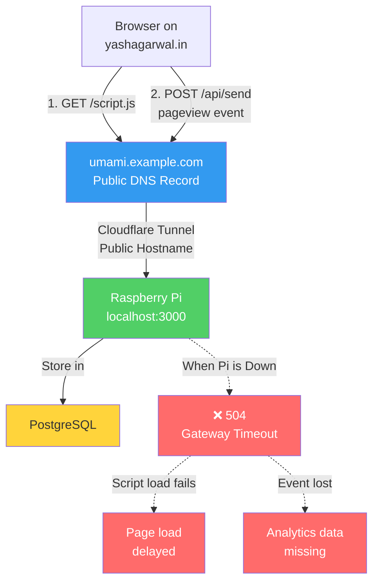

I have been using [Vercel Analytics](https://vercel.com/docs/analytics) and [Cloudflare Web Analytics](https://www.cloudflare.com/en-in/web-analytics/) for tracking the traffic on this blog. While both services are great, I wanted to explore self-hosting an analytics solution to have more control over my data. After some research, I decided to use [Umami](https://umami.is/), a simple, open-source, privacy-focused web analytics tool. I have used Umami before, when PlanetScale used to have a free tier for their serverless MySQL database. Meanwhile, Umami also migrated from v2 to v3 and with that came the headache of database migration. Since PlanetScale had discontinued their free tier, I ditched Umami and moved to Vercel and Cloudflare for managing the analytics for this blog.

Recently, I bought a Raspberry Pi 5 to set up a home server for various projects. I thought it would be a great opportunity to self-host Umami on my Raspberry Pi. Only one issue &ndash; I don't have a UPS and I can't ensure 24x7 uptime for my Raspberry Pi server. This meant that if my home internet goes down or there's a power outage, my Umami instance would be inaccessible. I needed a solution that would allow me to self-host my Umami instance while accessible on public internet. I also needed a way to ensure that I don't lose any analytics data during Pi downtime.

This post outlines various steps I took to build a system matching my requirements using Cloudflare Workers as a proxy server, Cloudflare Durable Objects as temporary storage and Cloudflare KV as a cache, while staying within the free tier limits of Cloudflare.


# Setting up Raspberry Pi

This was the easiest part of the process. I followed the official [Umami installation guide](https://umami.is/docs/installation) to set up Umami on my Raspberry Pi. I used Docker to run the Umami instance and connected it to a local PostgreSQL database also running in a Docker container.

This process exposed my Umami instance on my localhost at port 3000. Now I needed to find a way to access this instance from the public internet. I have past experience using [Cloudflare Tunnels](homelab-using-cloudflared) to expose local services to the internet so this wasn't too difficult to setup either.

Here's the Docker Compose configuration I used:

```yaml
# docker-compose.yml
version: '3'
services:
  umami:
    image: ghcr.io/umami-software/umami:postgresql-latest
    ports:
      - "3000:3000"
    environment:
      DATABASE_URL: postgresql://umami:umami@db:5432/umami
      DATABASE_TYPE: postgresql
      APP_SECRET: ${APP_SECRET} # Generate with: openssl rand -base64 32
    depends_on:
      db:
        condition: service_healthy
    restart: always

  db:
    image: postgres:15-alpine
    environment:
      POSTGRES_DB: umami
      POSTGRES_USER: umami
      POSTGRES_PASSWORD: umami
    volumes:
      - umami-db-data:/var/lib/postgresql/data
    restart: always
    healthcheck:
      test: ["CMD-SHELL", "pg_isready -U umami -d umami"]
      interval: 5s
      timeout: 5s
      retries: 5

  cloudflared:
    image: cloudflare/cloudflared:latest
    command: tunnel --no-autoupdate run
    environment:
      TUNNEL_TOKEN: ${TUNNEL_TOKEN}
    restart: always

volumes:
  umami-db-data:
```

## Setting up Cloudflare Tunnel

Now came the interesting part. I **didn't** want to expose my Raspberry Pi directly to the public internet for security reasons. I wanted the tunnel to be accessible **only** by my Cloudflare Workers proxy layer.

Setting up the tunnel was straightforward:

1. **Create a tunnel** from the Cloudflare dashboard under Networks → Tunnels or using the Cloudflare Tunnel CLI:

```bash
cloudflared tunnel create umami-tunnel
```

2. **Generate a tunnel token** - The CLI autogenerates this.
3. **Configure the tunnel token** in the `.env` file:

```bash
# .env
TUNNEL_TOKEN=<your-tunnel-token-here>
APP_SECRET=<generate-with-openssl-rand-base64-32>
```

4. **Configure ingress in the Cloudflare dashboard** - this is where the magic happens. Instead of creating a public hostname like `umami.yourdomain.com`, I configured the ingress to route traffic from the tunnel to `http://umami:3000` (the Umami service in Docker Compose).

**Important:** I did **not** add a public hostname in the tunnel configuration. This keeps the tunnel private - it's only accessible via its internal Cloudflare Tunnel URL (format: `https://<tunnel-id>.cfargotunnel.com`).

This URL is only reachable from within Cloudflare's network, which means only my Workers can access it. The public internet cannot hit my Pi directly.

Start everything with Docker Compose:

```bash
docker-compose up -d

# Verify all services are running
docker-compose ps

# Check cloudflared logs to confirm tunnel connection
docker-compose logs cloudflared
```

You should see something like:
```
cloudflared  | Connection <UUID> registered connIndex=0 ip=<IP> location=<LOCATION>
cloudflared  | Registered tunnel connection
```

At this point, my Umami instance was accessible via the private tunnel URL, but **only** from within Cloudflare's infrastructure. Perfect for what I needed &ndash; a secure way to access to my Pi from outside my home without exposing it to the wider internet.


## Setting up blog to use Umami

To allow my blog to connect to the self-hosted Umami instance, I had to expose my private tunnel to the public internet by creating a DNS record that pointed to the tunnel. The next step was to configure my blog to use this Umami instance for analytics. I logged into the Umami dashboard and created a new website entry for my blog. Once configured, I copied the website ID and updated my blog's configuration to use the new Umami instance.

```html
<head>
  <script
    is:inline
    defer
    src="https://umami.yashagarwal.in/script.js"
    data-website-id={UmamiWebsiteId}
  ></script>
</head>
```
With this setup, my blog was now sending analytics data to my self-hosted Umami instance running on my Raspberry Pi, accessible via the Cloudflare Tunnel.

However, what happens when my Raspberry Pi goes offline, either due ot power outage or internet issues?

